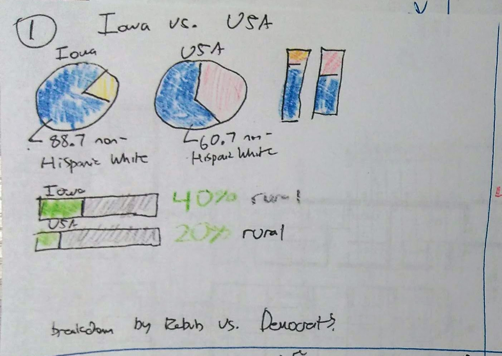

# Final Project
## Project Proposal 

### Summary of Proposal: “Four Tickets Out” 
Maybe it’s because I’m from Iowa, but I’ve always been interested in presidential election season. Every four years, candidates descend on my home state to set up their political operation, eat various fried foods at the state fair, and, most importantly, pander. It is not news to anyone that Iowa receives a disproportionate attention of both presidential candidates and the media. Moreover, many outlets have drawn attention to how the population of Iowa is not representative of the core constituencies of both the Republican and Democratic parties. 

Despite all criticism, Iowa remains “first” in line – this project seeks to explore what this means for the average voter outside the cornfields. Many candidates who win Iowa fail to win the nomination. The top finishers in Iowa, however, have proven to have a real shot of moving forward – while anyone outside the top four often suspend their campaigns before the voters of other states get to consider their alternatives. 

This project will show how Iowa, fairly or unfairly, winnows the field. Though the project will evaluate how the campaigns of the “winners” of Iowa have panned out, more focus will be on those who finish outside the top tier. I hope to emphasize that doing well in Iowa really does matter – and that finishing outside the top four has historically spelled doom. In terms of the 2020 contest - I aim to show that if your candidate has not risen above in Iowa, you need to consider putting in your time/effort/money in sooner than later.

### How project will be completed: 
Data visualizations will be made from data (discussed below) using various platforms learned in class - whatever works best for a particular visualization (I anticipate using RAWGraphs to make the alluvial diagram). Depending on the data I am still looking to acquire, I may incorporate some GIS. It will be using the general story structure I ownline below. The final product / presentation will be hosted on Shorthand. 

### (Draft) Story Outline: 
(1) Brief history of the Caucus, how it works 
(2) (DataViz 1): Acknowledge Iowa demographics are not representative of the USA (concern #1) 
(3)	(DataViz 2) Acknowledge that, despite all the attention, Iowa does not have the best record of picking the eventual winners of the nomination – especially on the Republican side (concern #2) 
(4)	Make the case that there are “Four Tickets Out of Iowa” – the top four finishers have been able to continue their campaigns, with the fourth-place finisher occasionally winning the nomination. Those on the outside have never fared well. 
(5) (DataViz 3) Something like an alluvial diagram that demonstrates the fates of the “winners” versus “top finishers” versus “everyone else” – how the campaigns usually play out after Iowa. 
(6) Conclusion: Doing well in Iowa matters. Show current status of candidates on Democratic side (DataViz 4) 
(7) 2020 Call To Action: If your preferred candidate is not in the top tier, you might want to put in the work / donate before Iowa. 

### Sketches 

IMG_20190922_210929080.jpg

IMG_20190922_210929080 (2).jpg

### Data (Draft) 

I have compiled data from a few sources - the initial Caucus data was largely scraped from [this document](http://caucuses.desmoinesregister.com/caucus-history-past-years-results/) produced by the Des Moines Register in 2012 using Tabula. Data after 2008 was appended from [this](http://data.desmoinesregister.com/iowa-caucus/history/index.php#2016/gop/co/palo-alto) Des Moines Register source. [538](https://projects.fivethirtyeight.com/2020-primaries/democratic/iowa/) and [RealClearPolitics](https://www.realclearpolitics.com/epolls/2020/president/ia/iowa_democratic_presidential_caucus-6731.html) have good information on the current state of the race in Iowa. I will have to do some research to confirm/code the eventual fates of select campaigns. As far as mapping the demographics of Iowa - I can compare [data of Iowa](https://www.census.gov/quickfacts/IA) with the [USA generally](https://www.census.gov/quickfacts/usa) using US Census Data. Currently waiting to see if I can get some data that was taken down from the Des Moines Register website. I also welcome any suggestions you may have. 

[Back](https://jeffpflanz.github.io/Jeff-CMU-Repository/)
