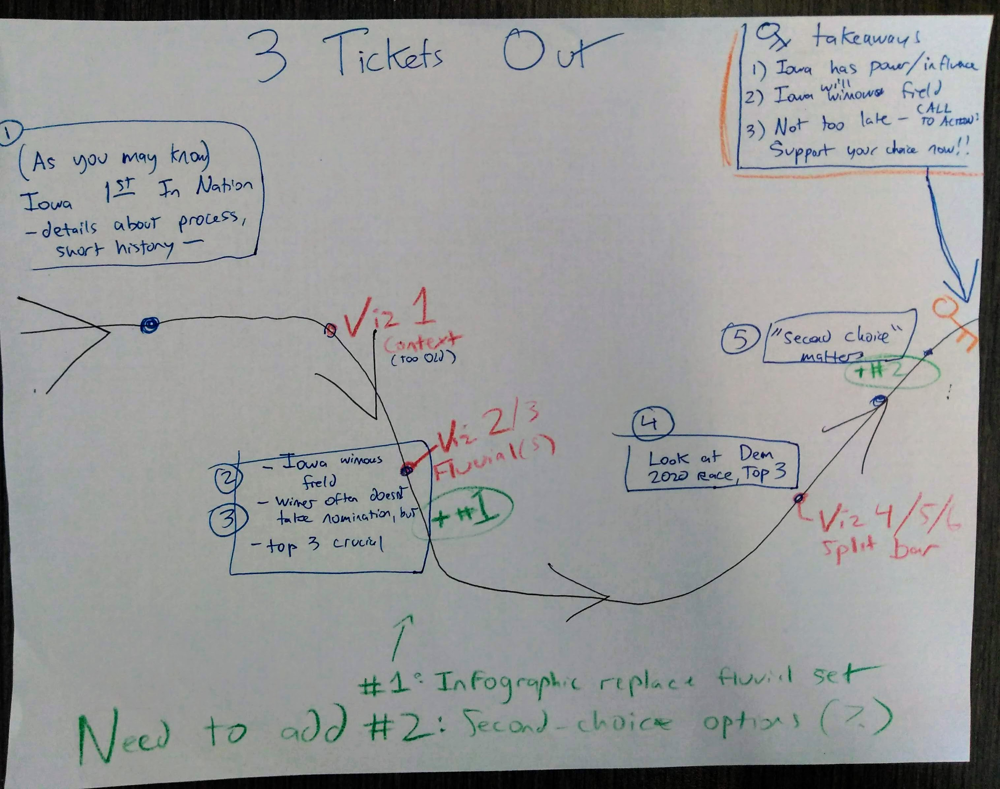
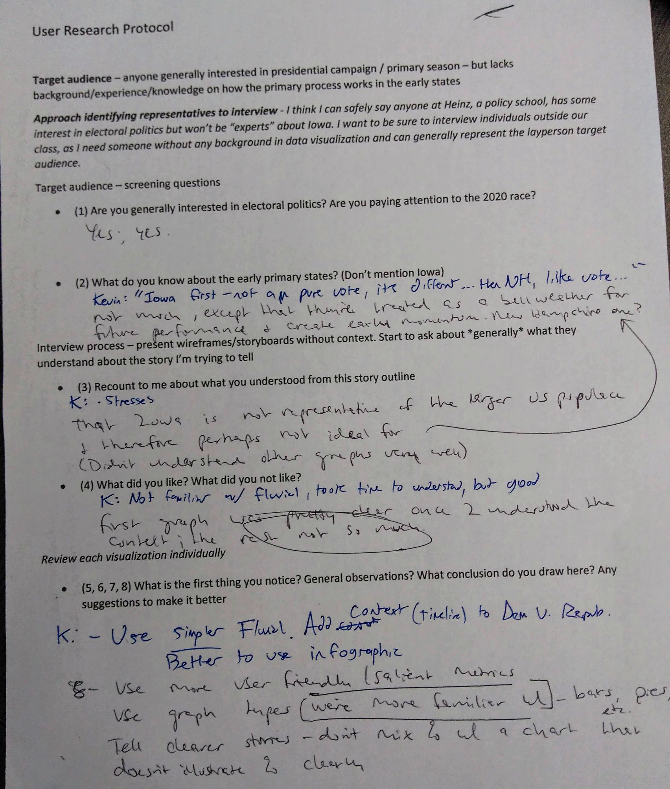
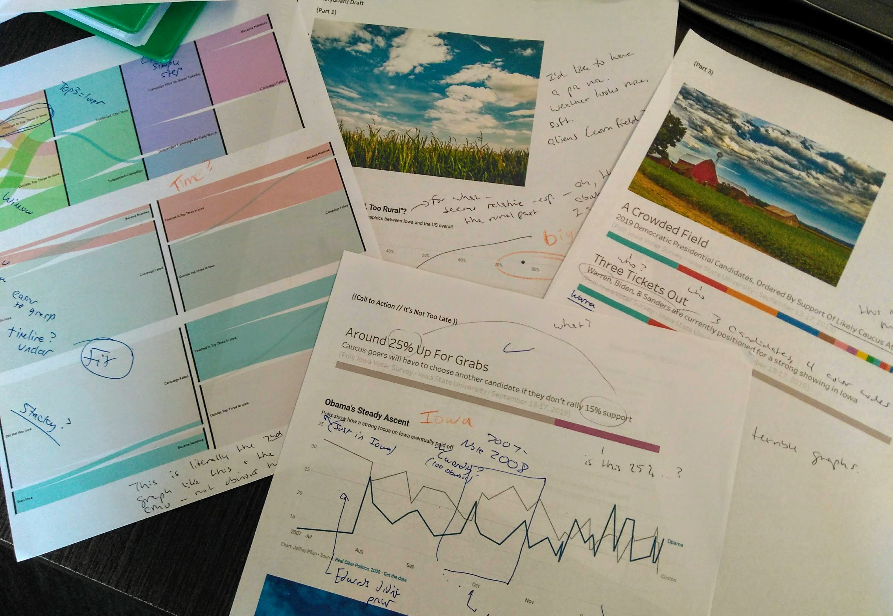
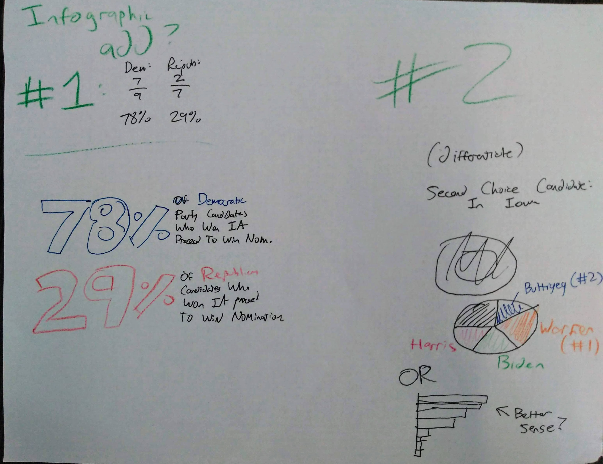

# Final Project
## Part 1 - Project Proposal 

### Summary of Proposal: “Three Tickets Out” 
Maybe it’s because I’m from Iowa, but I’ve always been very interested in presidential elections. Every four years, candidates descend on my home state to set up their political operations, eat various fried foods at the state fair, and, most importantly, pander. It is not news to anyone that the state of Iowa receives a disproportionate amount of attention from both presidential candidates and the media. Moreover, many outlets have drawn attention to how the population of Iowa is not representative of the core constituencies of both the Republican and Democratic parties. 

Despite all criticism, Iowa remains “first” in line – this project seeks to explore what this means for the average voter outside the cornfields. It is true that many candidates who win Iowa fail to win the nomination of their party. The top finishers in Iowa, however, have proven to have a real shot of moving forward – while anyone outside the top three often suspend their campaigns before the voters of other states get to consider them. 

This project will show how Iowa, fairly or unfairly, winnows the field. Though the project will evaluate how the campaigns of the “winners” of Iowa have panned out, more focus will be on those who finish outside the top tier. I hope to emphasize that doing well in Iowa really does matter – and that finishing outside the top three has historically spelled doom. In terms of the 2020 contest - I aim to show that if your candidate is not near the top in Iowa, you need to consider putting in your time/effort/money in sooner than later.

### How project will be completed: 
Data visualizations will be made from data (discussed below) using various platforms learned in class - whatever works best for a particular visualization (I anticipate using RAWGraphs to make the alluvial diagram). Depending on the final data, I may incorporate some GIS. My project will be using the general story structure I ownline below, the final product / presentation will be hosted on Shorthand. 

### (Draft) Story Outline: 
(1) Brief history of the Caucus, how it works 
(2) (DataViz 1): Acknowledge Iowa demographics are not representative of the USA (concern #1) 
(3)	(DataViz 2) Acknowledge that, despite all the attention, Iowa does not have the best record of picking the eventual winners of the nomination – especially on the Republican side (concern #2) 
(4)	Make the case that there are “Three Tickets Out of Iowa” – the top three finishers have been able to continue their campaigns, with the fourth-place finisher occasionally winning the nomination. Those on the outside of the top four have never lasted. 
(5) (DataViz 3) Something like an alluvial diagram that demonstrates the fates of the “winners” versus “top finishers” versus “everyone else” – how the campaigns usually play out after Iowa. 
(6) Conclusion: Doing well in Iowa matters. Show current status of candidates on Democratic side (DataViz 4) 
(7) 2020 Call To Action: If your preferred candidate is not in the top tier, you might want to put in the work / donate before Iowa. 

### Sketches 

### Data (Draft) 

I have compiled data from a few sources - initial Caucus data was largely scraped from [this document](http://caucuses.desmoinesregister.com/caucus-history-past-years-results/) produced by the Des Moines Register in 2012 using Tabula. Data after 2008 was appended from [this](http://data.desmoinesregister.com/iowa-caucus/history/index.php#2016/gop/co/palo-alto) Des Moines Register source. [538](https://projects.fivethirtyeight.com/2020-primaries/democratic/iowa/) and [RealClearPolitics](https://www.realclearpolitics.com/epolls/2020/president/ia/iowa_democratic_presidential_caucus-6731.html) have good information on the current state of the race in Iowa. I will have to do some research to confirm/code the eventual fates of select campaigns. As far as mapping the demographics of Iowa - I can compare [data of Iowa](https://www.census.gov/quickfacts/IA) with the [USA generally](https://www.census.gov/quickfacts/usa) using US Census Data. Currently waiting to see if I can get some data that was taken down from the Des Moines Register website. I also welcome any suggestions you may have. 

-------------------------------------------------------------------------------------

## Part 2 - Project Wireframes/Storyboards and User Research 

### Wireframe and Storyboard Detail

Making wireframes and the storyboard really helped clarify the order of the story I want to tell. My approach to wireframing was perhaps more involved than it should be - I spent a lot of time compiling, editing, and building the data I needed. At that point, I thought I needed to develop online visualization drafts to get the feedback I wanted going into next week. After making my initial visualizations, I made a wireframe in Microsoft Word - trying to mimic the top-to-bottom Shorthand page that I intend to make next week. I intentionally did not add in many captions or descriptions - as I wanted my users to approach my visualizations without context. If they were confused, I was able to take notes about what I exactly needed to clarify. 

[My wireframe / user research work is located here.](https://jeffpflanz.github.io/Jeff-CMU-Repository/WireframeWithEdits.pdf)

The above document details my draft layout of Shorthand (wireframe), many initial data visualization options, photos, a (written) storyboard, and my user research draft questions. The document also has edits/additions that I intend to incorporate (after learning in feedback sessions). 

My visual storyboard is below (green color shows the additional data visualizations I intend to include - also inspired by user research discussions): 

### Recap of user research and incorporation of feedback 

I took my project to three individuals outside of our class - let's call them K, P, and L. I made my wireframe in Microsoft Word so I could print out my visualizations in the order I desired. The physical copy also removed some of the bells and whistles that would otherwise be accessible (like being able to interact with the graphs, going to data points for details). 

One regular observation was this - all three were not familiar with fluvial diagrams, so there was not an "immediate" impact. Once they took time to understand what was going on, they generally liked it (except for P - who told me he was not a fan of using this "new/challenging" visualization in general). I eventually concluded to take out a step ("Survived After Iowa") because they seemed to think that layer didn't add much useful information. K particularly focused on the need to add some missing details (like specific timeframes/dates, adding in some of the names of candidates, polls just focused on Iowa Caucus-goers).

The visual storyboard above shows where I plan to include new/additional visualizations. The wireframe pdf document documents feedback and planned additions/changes in green. I did not find any need to make major changes to the ordering of my story - however, I may rearrange the ordering of some visualizations (specifically placing "Iowa winners often don't win nomination" infographic ahead of any "...but it is crucial to finish in the top three of Iowa" visualizations). 

Unfortunately, I feel limited by technology / my coding skills. There are some things my reviewers pointed out that I would have already changed if I could. For example, two requested that I make the dots larger on the "Two White, Too Old, Too Rural" dot chart - I could not find a way to do that on Datawrapper. Moreover, there are limited ordering/coloring options for fluvial charts on RAWGraphs. I may seek help/guidance from Matt on these issues.  

All in all, I am glad I got feedback from three people - they each had at least a few unique suggestions. The discussions also made clear which visualizations I had to tweak in order to achieve the "immediate" story impact. 

Below are sketches of new/additional visualizations I hope to include (ran out of time this week to research/develop): 

## Part 3 - Final Deliverables 

#### ["Three Tickets Out" - Final Project On Shorthand](https://carnegiemellon.shorthandstories.com/threeticketsout/index.html)
##### ["Three Tickets Out" - Presentation On Shorthand](https://carnegiemellon.shorthandstories.com/ThreeTicketsOutPresentation/index.html)

### Notes on Target Audience 
My target audience is anyone generally interested in presidential campaign / primary season – but lacks background/experience/knowledge on how the primary process works in the early states. My approach in identifying representatives to interview - I think I can safely say anyone at Heinz, a policy school, has some interest in electoral politics but won’t be “experts” about Iowa. 

My adjusted Shorthand project for the one minute "lightning" presentation is bare bones - I cut out all the text. As I only have a minute, I want to keep my audience focused on the visualizations and hope they convey the story I am trying to tell. Unfortunately, I do not have enough time to discuss everything I created and learned about in the process. I will focus on the history of the Iowa Caucuses and how the process work. I plan to leave a bit of a cliffhanger - instead of speaking about who I think will win the Caucuses this year (based on first/second choice data), I will direct any interested audience members to my full project. 

### Final Reflections - Completeing the Project
This whole process was a lot more time intensive than I imagined - but in a good way. I found myself really interested in trying to convey what Caucus night feels like and the impact it has on the presidential race. The project also provided me an opportunity to make some interesting discoveries - given the unique rules of the Caucus, I don't think I properly understood how important the "second choice" metric is on Caucus night. 

I had a lot of fun making the visualizations and tried to use every platform that we were introduced to. I quickly realized that I had some limitations in my design choices - since I have little knowledge of coding in this context, I could not make all of the tweaks that I wanted to on visualizations made from online platforms (RAWgraphs, Datawrapper). Moreover, I feel like I could've made a better product on Markdown if I was not figuring out how it all worked in the last weeks of the class. While the small details I could not fix irked my perfectionist tendancies, I am proud of the final product - in addition to my GIS work, data visualization + storytelling is a real marketable skill that is already opening up opportunities I did not have before. 

[Back](https://jeffpflanz.github.io/Jeff-CMU-Repository/)
